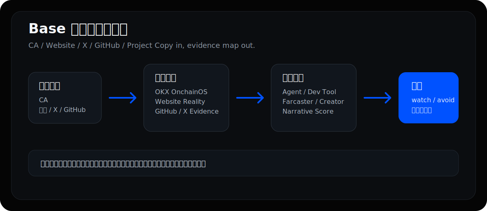
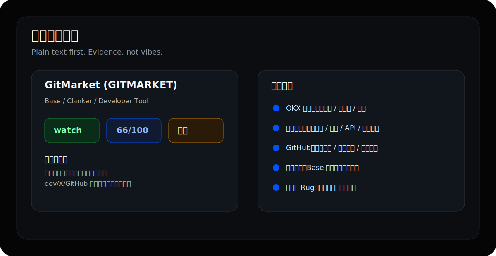

# Base Evidence Radar

🌐 Language: [中文](./README.md) | [English](./README.en.md)

📘 Product Intro: [中文介绍](./docs/product-introduction.zh.md) | [English Intro](./docs/product-introduction.en.md)

> A Codex Skill for first-pass evidence checks on Base product tokens.
> Input a CA, website, X/Twitter profile, GitHub repo, or project copy. Output a plain-text due diligence report.



## One-Line Install

```bash
git clone https://github.com/qiuqiubuchongle-cloud/base-narrative-radar.git && cd base-narrative-radar && npm test
```

For the full report, install and log in to OKX OnchainOS CLI first:

```bash
npx skills add okx/onchainos-skills --yes --global
onchainos wallet status
```

If `onchainos wallet status` returns normally, on-chain data access is available. Without OnchainOS, `base:discover` can still use DEX Screener and GitHub for partial discovery, but `base:dd:auto` will miss OKX risk, creator, protocol, holder, and other on-chain evidence.

## Quick Start

The recommended entry point is one command:

```bash
npm run base:dd:auto -- 0xTokenAddress
```

It automatically runs:

```text
CA -> discover website/X/GitHub/docs -> read on-chain data -> inspect website evidence -> inspect GitHub evidence -> output a plain-text report
```

If you already know the website, X account, or GitHub repo, add them manually:

```bash
npm run base:dd:quick -- 0xTokenAddress \
  --website https://example.xyz \
  --twitter https://x.com/project \
  --github https://github.com/project/repo
```

Use deep mode only when preparing long-form content or researching a broader narrative:

```bash
npm run base:dd:deep -- 0xTokenAddress --notes "paste project copy, tweets, dev claims here"
```

## Dependencies

| Dependency | Required | Purpose |
|---|---:|---|
| Node.js 18+ | Required | Run scripts |
| OKX OnchainOS CLI | Required for full reports | Token report, risk scan, creator/protocol, on-chain price and liquidity |
| DEX Screener public API | Automatic | Discover website, X, GitHub, docs, market cap, liquidity |
| GitHub public API | Automatic | Search same-name repos and explicit GitHub evidence |
| Basescan / Etherscan API key | Optional | Independently verify contract creator |
| Tavily / Brave / SerpAPI | Optional | Deep-mode news, ecosystem references, similar narrative cases |
| X / Twitter API Bearer Token | Optional but useful | Search official claims, dev interaction, KOL discussion, and same-name noise |
| xAI / Grok API key | Optional enhancement | Use Grok Web Search + X Search for mechanism, team, entity-interaction, and valuation research |

Optional environment variables:

```bash
cp .env.example .env
```

If you have an X API v2 Bearer Token:

```bash
TWITTER_BEARER_TOKEN=xxxxx
# or
X_BEARER_TOKEN=xxxxx
```

For Grok research mode:

```bash
XAI_API_KEY=xxxxx
XAI_MODEL=grok-4.20-reasoning
BASE_XAI_LANGUAGE=zh
```

## What Is It?

Base Evidence Radar is a fast due diligence tool for Base product tokens.

You can give it:

- Base token CA
- Project website
- X / Twitter link
- GitHub repo, organization, or user
- Project intro, tweet text, or dev copy

It combines OKX OnchainOS data, website product traces, GitHub evidence, X/Twitter claim signals, and case-library comparisons. The goal is to decide whether the project evidence holds up before treating the narrative as meaningful.

In plain English:

> What does this Agent do? Is the GitHub real? Is there a product? Did the dev claim it? Is the narrative actually worth researching?

Let the Skill handle the first pass.

## Why This Exists

Base opportunities increasingly look like product judgment problems.

On many meme chains, community, chart, and virality may be enough for a first read. On Base, many launches wear a product skin: AI Agents, developer tools, Farcaster assets, automation workflows, creator economy, and on-chain app demos.

The hard part: AI makes fake product surfaces cheap.

- A website can be generated in minutes.
- A GitHub repo can be assembled quickly.
- Project copy can sound like a real startup.
- A demo may only be a teaser.
- One X post saying “full MVP is live” can be enough for the market to hallucinate.

Sharp traders can often judge this in minutes. Most people spend too long just gathering links. By the time the project is understood, it has either run or died.

Base Evidence Radar does not predict price. It does one thing:

> Turn “I cannot tell if this is valuable” into a structured evidence table.

## Core Capabilities

### 1. CA Identity Check

Reads OKX OnchainOS data to identify:

- token name / symbol
- market cap, liquidity, holders
- risk level and token tags
- creator / protocol clues

Note: `riskLevel: LOW` only means no common automated flags were detected. It does not prove the project is safe.

### 2. Launch Surface Detection

Classifies whether the project looks like it came from:

- Clanker
- Virtuals
- Zora
- Flaunch
- Base App
- Unknown

Different surfaces require different reads. Clanker is more about dev claim and social flow. Virtuals is more about API, demo, revenue, and ecosystem usage. Flaunch is more about whether its mechanism creates real demand.

### 3. Website Product Evidence

A pretty website is not proof.

The Skill checks:

- whether the website is accessible
- whether there is enough real page content
- API / form / auth / dashboard / connect wallet traces
- app / dashboard / docs / SDK / API / playground routes
- whether the demo is real or simulated / teaser
- template shell, coming soon page, or AI-generated copy signals
- whether it is a generic launchpad page rather than a project-owned site

### 4. GitHub Product Evidence

It separates:

- website or X explicitly linking to GitHub
- recently updated GitHub repos
- repo components such as app / contracts / sdk / cli / docs / API / server / playground
- coherent product map under the same owner
- same-name search results only
- stale, archived, or irrelevant repos

Explicit linkage matters more than stars. A same-name GitHub repo is only weak evidence.

### 5. X / Twitter Evidence

For Base projects, X can matter more than the website.

If `TWITTER_BEARER_TOKEN` or `X_BEARER_TOKEN` is configured, Auto / Deep mode searches:

- token CA
- project name / symbol
- website domain
- official X handle
- `from:official_account` and `@official_account` related tweets

It reports:

- whether the official account directly claimed the project
- whether high-follower accounts discussed it
- whether results are mostly same-name noise
- tweet links, authors, follower counts, and basic engagement

Without X API, the report does not fail. It marks `missing_api` and continues with DEX Screener or manually provided X links.

### 6. Narrative Reference

The Skill still keeps narrative classification, but narrative is only a reference layer, not the core score.

```text
Narrative reference: AI Agent / Developer Tool / Automation Workflow / ...
```

Supported Base narrative categories:

- AI Agent
- Developer Tool
- Automation Workflow
- Farcaster / Social Asset
- Content / Creator Economy
- Trading / Finance Tool
- Infra / API / Data

Narrative reference answers three questions:

1. Can the story be explained in one sentence?
2. Is it a familiar Base-native pattern?
3. Do the website, GitHub, X, and launch surface support the story?

If the website looks like a template shell, GitHub is not claimed, and X is quiet, even a strong narrative should stay in weak-watch or avoid territory.

### 7. Product-Rug Risk

Many Base risks are not classic meme rugs. They are product-shaped packaging.

Common risk types:

- `story_shell`: strong concept, weak evidence
- `dev_silent`: dev does not claim, interact, or update
- `fake_product`: website / whitepaper exists, usable product does not
- `repo_mismatch`: GitHub and token story do not match
- `launchpad_noise`: batch noise from launch surfaces
- `liquidity_exit_risk`: thin liquidity, difficult exit

### 8. Base Agent Case Library

The repo includes an evidence-first case library:

```text
references/base-agent-evidence-cases.json
```

It is not for shilling. It is used for comparison:

- `real_build`: website + GitHub support a real product
- `front_end_shell`: polished site, but demo/static/frontend shell signals are obvious
- `repo_mismatch`: same-name GitHub, 404, private repo, or mismatch
- `short_lived_launch`: launchpad/social token with weak product evidence
- `promising_but_unproven`: some evidence exists, but product loop is not proven

The report prioritizes this kind of judgment: does the project look closer to a real build case, or closer to a polished shell with evidence gaps?

## Auto / Quick / Deep

### Auto: CA In, Discovery + Due Diligence Out

Recommended for daily use:

```bash
npm run base:dd:auto -- 0xTokenAddress
```

Auto mode discovers project information from multiple data sources, then feeds the results into due diligence:

| Source | What it can discover |
|---|---|
| DEX Screener | Website, X/Twitter, GitHub, Telegram, Discord, market cap, liquidity, price |
| OKX OnchainOS | Token name, symbol, risk, creator, protocol, on-chain basics |
| Basescan / Etherscan V2 | Contract creator and creation transaction, if API key exists |
| GitHub Search | Same-name repo candidates and organization repos |
| X / Twitter API | Official claims, discussion quality, KOL interaction, requires Bearer Token |

### Quick: First Read

Use Quick mode for daily CA checks:

```bash
npm run base:dd:quick -- 0xTokenAddress
```

Quick mode returns:

- project identity
- launch surface
- product evidence grade
- website evidence grade
- GitHub evidence grade
- X / Twitter claim signals
- case comparison
- narrative reference
- initial watch / avoid verdict

### Deep: Research Mode

Deep mode adds:

- external news
- ecosystem references
- KOL / social / mirror pages
- similar narrative cases

```bash
npm run base:dd:deep -- 0xTokenAddress \
  --website https://example.xyz \
  --twitter https://x.com/project \
  --github https://github.com/project/repo \
  --notes "project intro, dev claims, tweet text"
```

Deep mode works best with:

- `TAVILY_API_KEY`
- `BRAVE_API_KEY` / `BRAVE_SEARCH_API_KEY`
- `SERPAPI_KEY`

Without a search API, it can still run, but results may be slower and thinner.

### Grok: Mechanism, Team, Entity Interaction, and Valuation Research

If `XAI_API_KEY` is configured, you can run a Grok/xAI research pass:

```bash
npm run base:grok -- 0xTokenAddress \
  --website https://example.xyz \
  --twitter https://x.com/project \
  --github https://github.com/project/repo \
  --market-cap "$1.2M" \
  --language en
```

It uses Grok Web Search and X Search to analyze:

- product form: what it is and who uses it;
- mechanism type: new mechanism, assembled mechanism, fork, or narrative wrapper;
- flywheel: growth, revenue, usage, and token-value loop;
- irreplaceability: whether the mechanism is hard to copy;
- team and dev background: prior roles, projects, GitHub/X activity, reputation risk;
- known-entity interaction: real builders, funds, protocols, or ecosystem accounts;
- historical risk: old projects, abandoned repos, fake links, suspicious rebrands, same-name collisions;
- market-cap-adjusted expectation: what evidence is needed to justify the current valuation.

Outputs are saved to:

```text
data/xai-research/<ca>.xai.json
data/xai-research/<ca>.xai.txt
```

Use this when a project is interesting enough for deeper research. For fast daily filtering, start with `base:dd:auto`.

## Example Output



```text
Base Evidence Radar Report

Project: GitMarket (GITMARKET)
Contract: 0xd510829f654e102a57c4f6d9bb6879b7cc2ccb07
Mode: quick
Verdict: watch
Overall Score: 66/100
Product Evidence Grade: credible_but_incomplete
Product Evidence Score: 55/100
Case Comparison: promising_but_unproven
Launch Surface: Clanker
Narrative Reference: Developer Tool
Product-Rug Risk: low

One-line read
There is some product evidence and on-chain baseline, but dev/X/GitHub or real usage still needs confirmation.

Core Scores
On-chain Basics: 70/100
Product Evidence: 55/100
Website Evidence: 55/100
GitHub Evidence: 45/100
Narrative Reference: Developer Tool / Base devtool
```

Reports are saved to:

```text
data/reports/<ca>.json
data/reports/<ca>.txt
```

The default report is plain text, easy to copy into a chat, share with a group, or rewrite with AI.

## Verdict Levels

| Verdict | Meaning |
|---|---|
| `strong_watch` | On-chain basics, website evidence, GitHub evidence, and X claim signals are relatively complete. Worth focused observation. |
| `watch` | Some product evidence and on-chain baseline exist, but more confirmation is needed. |
| `weak_watch` | Narrative or hype exists, but product evidence is weak. |
| `avoid` | Key evidence is missing or risk is high. More likely noise or packaging. |

`watch` means “worth researching”, not “buy”.

## Project Structure

```text
base-narrative-radar/
├── SKILL.md
├── README.md
├── README.en.md
├── docs/
│   ├── product-introduction.zh.md
│   └── product-introduction.en.md
├── assets/
│   ├── base-radar-flow.svg
│   └── base-report-card.svg
├── references/
│   ├── base-agent-evidence-cases.json
│   └── base-narrative-rubric.md
├── scripts/
│   ├── base_project_discover.mjs
│   ├── base_token_due_diligence.mjs
│   └── base_xai_research.mjs
├── config/
│   └── base_token_due_diligence.config.json
├── agents/
│   └── openai.yaml
├── package.json
└── .env.example
```

## Who It Is For

- Base project hunters who want to check a CA before digging deeper
- Agent / devtool / creator / Farcaster narrative researchers
- People who often get fooled by polished websites, GitHub repos, and AI startup copy
- Users who want to separate real builders from product-shaped packaging
- Content creators or researchers building Base watchlists

## What It Is Not For

- Not an auto-trading tool
- Not a buy signal generator
- Not a replacement for human judgment
- Not designed for generic non-Base token analysis
- Not useful when no project clues exist at all

## Positioning

Base Evidence Radar is not a “find me a 100x token” tool.

It is a first-pass filter. It helps you discard projects with incomplete information, unclaimed GitHub repos, shell-like websites, and keyword-stuffed narratives.

Its value is not making you smart. Its value is helping you avoid the most basic packaging traps.

## Disclaimer

This is a 1.0 Skill built by Qiuqiu for fun and research.

It is not investment advice, not a buy/sell signal, and not a security audit. It only provides a way to inspect Base product tokens by separating CA, website, GitHub, X, and project-copy evidence.

`strong_watch / watch / weak_watch / avoid` are research-priority labels, not trading instructions.

Feel free to fork and modify it: change the scoring rules, narrative categories, search APIs, address databases, screenshot modules, X data source, or even adapt it into a radar for another chain.

DYOR. Your wallet is yours.

One more thing: Qiuqiu does not launch coins, accept paid token promotion, or lend his name to projects. This Skill was built to document lessons from past mistakes, and maybe gain a few followers and some traffic. If it helps, please like and interact. Having only 2,000+ followers is honestly a little embarrassing.

## License

MIT
